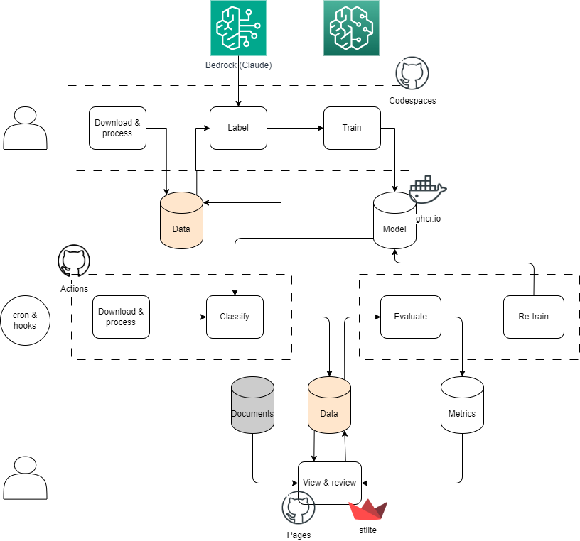

Project to create a _structured dataset of CMA cases and announcements_ by extracting information from documents published online... actually aim is to see how far can you go with "just" GitHub to:
* run a data pipeline with an NLP element to it using Actions,
* serve a [streamlit app](https://dayalstrub.github.io/announcements/) using Pages, and 
* develop ML pipelines in Codespaces.

⚠️ __Note:__ Still WIP. App requests are broken. Pipeline is not complete. Tiny classifier (that can run in Actions) is still a figment of my imagination.

## Idea



## Development

### Scripts

Scripts are developed interactively as notebooks using _jupytext_ to save the output as `py:percent`.

One off scripts, like bulk download and labelling using Bedrock, have been kept as scripts. Code that needs to make it's way into Actions and the App, are then refactored and moved.

Code is black, but precommit hooks, Actions and other formatting has not been set up.

### Slides

The _revealjs_ slides are rendered using [quarto](https://quarto.org/): 

```bash
quarto render slides/slides.qmd
```

### App

The streamlit app is deployed using GH Pages and [stlite](https://github.com/whitphx/stlite?tab=readme-ov-file#use-stlite-on-your-web-page-stlitemountable) - a port of Streamlit to Wasm, powered by Pyodide - via the index.html page.
See the stlite README for details on importing data, working with `requests` in Pyodide, etc.
